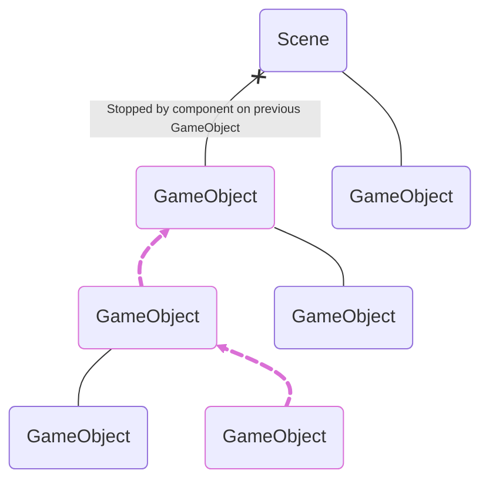
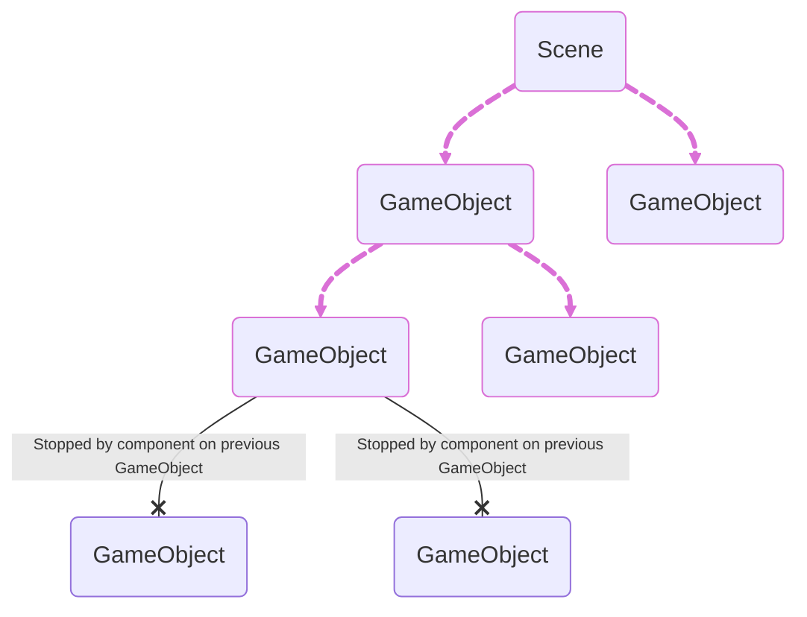

<h1 align="center">sbox-reactivity</h1>

A reactivity system for [s&box](https://sbox.game/). It makes writing code that runs in response to state changes easy.

```csharp
public class MyComponent : ReactiveComponent
{
	[Property, Reactive]
	public float Speed { get; set; } = 50f;

	[Reactive, Derived(nameof(_tintColor))]
	public Color TintColor { get; } = Color.Blue;

	private Color _tintColor()
	{
		return Math.Abs(Speed) <= 100f ? Color.Blue : Color.Red;
	}

	protected override void OnActivate()
	{
		Effect(() =>
		{
			var go = new GameObject();
			var model = go.AddComponent<ModelRenderer>();
			model.Model = Model.Cube;

			// Tint the model whenever it changes
			Effect(() => model.Tint = TintColor);
			
			// Spin the object every frame while the component is enabled
			Frame(() =>
			{
				var angles = go.LocalRotation.Angles();
				angles.yaw += Speed * Time.Delta;

				go.LocalRotation = angles;
			});

			// Destroy the object when the component is disabled
			return () => go.Destroy();
		});
	}
}
```

## Installation

- Add the [library](https://sbox.game/igor/reactivity) to your project via the editor
- Add `global using static Sandbox.Reactivity.Reactive;` somewhere in your project - usually `Assembly.cs`

## Quick Reference

- [States](#states)
- [Derived States](#derived-states)
- [Effects](#effects)
- [Reactive Components](#reactive-components)
- [Timers](#timers)
- [Collections](#collections)
- [Scene Events](#scene-events)

---

# Guide

You might be familiar with this paradigm if you've done any modern web frontend development within the last several years. Turns out it maps fairly well to gameplay programming. The core concepts revolve around creating *reactive state* that can be read by an *effect* to run some code when state changes.

## States

You can use the `State` method to create a simple reactive value that your code can react to when it changes. The value can be read/assigned via the `Value` property.

```csharp
var count = State(1);

count.Value++;

Log.Info($"Count is {count.Value}");
// Output: Count is 2
```

## Derived States

If you want to take some existing state and transform it into a new value, you can use the `Derived` method to create a reactive value that uses a function to compute its current value. The value can be read using the `Value` property.

Whenever a reactive value that the derived function reads to compute its value changes (either a `State` or another `Derived`), it will run that function again to get a new up-to-date value and store it until the next time it computes.

```csharp
var count = State(10);
var doubled = Derived(() => count.Value * 2);

Log.Info($"Doubled count is {doubled.Value}");
// Output: Doubled count is 20

count.Value = 15;

Log.Info($"Doubled count is {doubled.Value}");
// Output: Doubled count is 30
```

> [!TIP]
> You can avoid unnecessary computation by utilizing derived states. Instead of checking a reactive value directly inside an [effect](#effects)/derived state and branching on it directly, consider using a derived state to prevent the function from running at all unless the condition actually changes.

### Lazy Computation

Derived states are computed lazily: they won't run when their values change until you actually read them. This makes it a good place to do expensive work that you only want to do if the result is actually being used.

```csharp
var count = State(10);
var doubled = Derived(() => count.Value * 2);
// Derived hasn't run its compute function yet

count.Value = 15;
count.Value = 20;
// Still hasn't run

Log.Info($"Doubled count is {doubled.Value}");
// Ran only once, even though its dependency changed a few times
```

### Overriding Values

You can assign a value to a derived state to override its current value. The assigned value will remain until the next time the derived state recomputes and updates its value. If the derived state recomputes to the assigned value, reactivity won't occur since nothing actually changed.

This allows for optimistically updating a derived state's value when you know what its dependencies might be in the future. For example, updating a derived state to its expected value before sending a server RPC that would eventually update it. If the server changes some value that makes the derived state compute to the same value, nothing happens. If it computes to a different value, then it will update and reactivity will occur for the correct value.

## Effects

Now that you have some reactive state, you'll probably want to make something happen when it changes. This is done by using an effect. An effect is a function that tracks what reactive values were read during its execution, and run again whenever any of the values change.

Effects are created with the `Effect` method, and accept an `Action` parameter to run. When you create an effect, the given function is run immediately to check for dependencies.

```csharp
var count = State(1);

Effect(() =>
{
	Log.Info($"Count is {count.Value}")
});
// Output: Count is 1

count.Value++;
// Output: Count is 2
```

### Dependencies

An effect only runs when the reactive values read *during its execution* change. This means that if any reactive values that are not read due to something like returning early or being short-circuited in an if statement, they won't be added as dependencies and will not cause the effect to re-run if they change.

```csharp
var shouldPrint = State(true);
var count = State(1);

Effect(() =>
{
	if (!shouldPrint.Value)
	{
		return;
	}

	Log.Info($"Count is {count.Value}");
});
// Effect runs with output: Count is 1

count.Value++;
// Effect runs with output: Count is 2

shouldPrint.Value = false;
// Effect runs with no output

count.Value++;
// Effect doesn't run at all since `count` is no longer a dependency
```

### Teardowns

Effect functions can optionally return an `Action` to run when the effect is about to re-run due to a dependency changing, or when the current reactivity scope is about to be disposed. This teardown function is a good opportunity to do some cleanup with the old values.

```csharp
var shouldCreateObject = State(true);

Effect(() =>
{
	if (shouldCreateObject.Value)
	{
		var go = new GameObject();
		
		return () =>
		{
			Log.Info($"Changing from {shouldCreateObject.Value}");
			go.Destroy();
		};
	}
	
	// No teardown here since we didn't create the object
	return null;
});
// The game object is created immediately

shouldCreateObject.Value = false;
// Output: Changing from True
// The game object has been destroyed
// Effect runs again but no game object is created
```

### Nested Effects

Effects can be created inside other effects. This results in the nested effect being run inside a new reactivity scope that will be disposed when the parent effect re-runs or is being disposed. Reactive values read inside a nested effect don't cause their parent effect to re-run (unless the parent also reads that value). This unlocks some pretty powerful control over what code runs when.

```csharp
var showLight = State(true);
var lightColor = State(Color.White);

Effect(() =>
{
	if (!showLight.Value)
	{
		return null;
	}
	
	var go = new GameObject();
	var light = go.AddComponent<PointLight>();
	
	Effect(() =>
	{
		// Changing the light color inside an effect means that the game
		// object won't be re-created every time the color changes
		light.Color = lightColor.Value;
	});
	
	return () => go.Destroy();
});
// A game object with a white light is created

lightColor.Value = Color.Red;
// The existing light changes to red. The parent effect doesn't re-run and will
// not unnecessarily re-create the game object

showLight.Value = false;
// The game object is destroyed

showLight.Value = true;
// A game object with a red light is created since we haven't changed the color
```

### Untracking

If you need to read a reactive value in an effect without adding the state as a dependency, you can use the `Untrack` method to suppress reactivity tracking.

```csharp
var count = State(1);
var otherCount = State(1);

Effect(() =>
{
	Log.Info($"Count is {count.Value}");
	
	using (Untrack())
	{
		// Anything inside this scope will not become a dependency if read
		Log.Info($"Other count is {otherCount.Value}");
	}
	
	// Or you can give it a function to call without reactivity tracking, and return the result
	var other = Untrack(() => otherCount.Value);
	Log.Info($"Other count is {other}");
	
	// This effect only has a dependency on `count`
});
// Effect runs with output: Count is 1, Other count is 1

otherCount.Value++;
// Effect does not run
```

> [!TIP]
> You can check if the currently executing code is inside an effect by using the `IsTracking` method, allowing you to customize the behaviour of a method based on whether it's in a reactive context.

### Flushing

When a reactive value that an effect depends on changes, the effect is not immediately run and is instead scheduled to run at the end of the frame. This prevents unnecessary effect runs if you're changing multiple values that an effect depends on at the same time.

This is fine for most cases, but you might find yourself needing effects to run immediately after changing a value. The `Flush` method can be used to immediately run any effects that have been scheduled to run at the end of the frame (i.e. "flush" the reactivity system).

> [!NOTE]
> Creating an effect always executes the function immediately in order to track its dependencies.

```csharp
var count = State(1);

Effect(() =>
{
	Log.Info($"Count is {count.Value}");
});
// Effect runs immediately with output: Count is 1

count.Value++;
// Effect doesn't run and is scheduled to run at the end of the frame

count.Value++;
// Effect still hasn't run; it's waiting until the end of the frame

Flush();
// Effect runs with output: Count is 3
// Effect is up-to-date and no longer scheduled to run at the end of the frame
```

> [!NOTE]
> Some examples in this document would require a `Flush` call to actually execute in order, but were omitted for brevity.

## Effect Roots

All effects *must* be created inside of a reactivity scope. This is a "grouping" of reactive code that can be disposed of when it's no longer needed. If you're not using a [reactive component](#reactive-components), you can create a root reactivity scope with `EffectRoot` instead.

Effect roots are not reactive; they are only meant to contain other effects that can be disposed of later.

```csharp
var count = State(1);

var root = EffectRoot(() =>
{
	Effect(() =>
	{
		Log.Info($"Count is {count.Value}");
	});
});

// When you no longer need the code in the effect root to run, dispose it
root.Dispose();
```

> [!NOTE]
> Some examples in this document omit the required effect root for brevity.

## Reactive Components

Subclassing `ReactiveComponent` makes it easier to create reactive properties and effects for your components.

Effects can be created by overriding the `OnActivate` method and using any of the reactivity methods. This method is run inside an effect root when the component is enabled, and disposed of when the component is disabled.

### Properties

Use the `[Reactive]` attribute on your component properties to make them reactive. You can then use the properties in effects like you would any other state.

```csharp
public class MyComponent : ReactiveComponent
{
	[Reactive]
	public string MyProperty { get; set; } = "hello";
	
	protected override void OnActivate()
	{
		Effect(() =>
		{
			Log.Info($"Property value is {MyProperty}");
			
			return () =>
			{
				// This will run just before MyProperty changes, or when the component is about to be disabled
				Log.Info($"Property value changing from {MyProperty}");
			};
		});
	}
}
```

Properties that only have a getter can be made into a derived state using the `[Derived]` attribute, and specifying which method on the component to use as the computation function.

```csharp
public class MyComponent : ReactiveComponent
{
	[Reactive]
	public int Count { get; set; } = 1;
	
	[Reactive, Derived(nameof(_doubled))]
	public int Doubled { get; } = 1;
	
	private int _doubled()
	{
		return Count * 2;
	}
	
	protected override void OnActivate()
	{
		Effect(() =>
		{
			Log.Info($"Doubled is {Doubled}");
		});
	}
}
```

> [!NOTE]
> You can replace the example usages of the `State` and `Derived` methods in this document with a corresponding reactive property; they'll work the same.

## Timers

It's likely you'll want to call some code after a delay, or at regular intervals. There are various timer methods that can help you accomplish this.

Every timer method is tied to its current reactivity scope, which means they will stop running when the scope is disposed (e.g. a parent effect is about to re-run, a parent component is being disabled, etc). A function called by a timer is a plain function that has no reactivity whatsoever - a call to a timer function is treated as a fire-and-forget operation.

### Timeout

Runs a function after a delay.

```csharp
var shouldRun = State(true);

Effect(() =>
{
	if (!shouldRun.Value)
	{
		return;
	}

	Timeout(() =>
	{
		Log.Info("Timeout executed after one second!");
	}, TimeSpan.FromSeconds(1));
});

// Changing `shouldRun` to `false` before one second elapses prevents
// the function from ever being called
```

### Interval

Runs a function at a regular interval.

```csharp
var shouldRun = State(true);

Effect(() =>
{
	if (!shouldRun.Value)
	{
		return;
	}

	Interval(() =>
	{
		Log.Info("Called every second!")
	}, TimeSpan.FromSeconds(1));
});

// Changing `shouldRun` to `false` will stop the timer and prevent
// the enqueued interval function from ever being called
```

### Tick

Runs a function during every fixed update (i.e. game tick). Useful when used in a reactive component.

```csharp
public class MyComponent : ReactiveComponent
{
	[Reactive]
	public bool ShouldRun { get; set; } = true;
	
	protected override void OnActivate()
	{
		Effect(() =>
		{
			if (!ShouldRun)
			{
				return;
			}
			
			Tick(() =>
			{
				// ...do something every fixed update
			});
		});
	}
}

// Changing `ShouldRun` to `false` will stop the tick function from running.
```

### Frame

Runs a function during every update (i.e. frame). Useful when used in a reactive component.

```csharp
public class MyComponent : ReactiveComponent
{
	[Reactive]
	public bool ShouldRun { get; set; } = true;
	
	protected override void OnActivate()
	{
		Effect(() =>
		{
			if (!ShouldRun)
			{
				return;
			}
			
			Frame(() =>
			{
				// ...do something every update
			});
		});
	}
}

// Changing `ShouldRun` to `false` will stop the frame function from running.
```

## Collections

You can run some code for every item added to a collection by using the `Each` method. This tracks the collection *by index*, meaning that reactivity occurs when an item at any index in the collection changes its value, or when the collection grows/shrinks (i.e. adds or removes an item).

Item functions are tied to the current reactivity scope, meaning they will run their teardown functions (if given) when the scope is disposed. Item functions are considered effect roots: they are not reactive on their own, but you can create effects inside them.

> [!IMPORTANT]
> Mutating a collection is not supported for now; reactivity occurs only when a new collection is assigned to a reactive state.

```csharp
public class MyComponent : ReactiveComponent
{
	[Reactive]
	public Color Tint { get; set; } = Color.Blue;
	
	[Reactive]
	public Model[] Models { get; set; } = [Model.Cube, Model.Sphere];
	
	protected override void OnActivate()
	{
		// Creates a game object for each model in the array
		Each(
			() => Models,
			(model, i) =>
			{
				var go = new GameObject();
				go.LocalPosition = new Vector3(i * 50f, 0, 0);
				
				var renderer = go.AddComponent<ModelRenderer>();
				renderer.Model = model;
				
				// Update the model's tint every time it's changed
				Effect(() => renderer.Tint = Tint);
				
				// Destroy the game object if this index changes
				return () => go.Destroy();
			}
		);
	}
}

// Component creates 2 game objects with cube/sphere model, respectively

// Add an item
component.Models = [..component.Models, Model.Plane];
// Creates a new game object with a plane model

// Remove an item
component.Models = component.Models[..^1];
// Destroys the game object with the plane model

// Update an item
component.Models = [Model.Sphere, component.Models[1]];
// Destroys the game object with the cube model in index 0
// Creates a new game object in the first position with a sphere model in index 0
// Nothing happens for game object in index 1

component.Tint = Color.Red;
// All game objects are now tinted red without having been destroyed/re-created
```

## Scene Events

You'll most likely need to run some code in response to an external event that isn't necessarily reactive - player inputs, RPC calls, etc. This can be accomplished with scene events.

Scene events are plain objects that a reactive component can receive and do something with. There's no required type for scene events to be dispatched, but simple `record`s are recommended.

### Receiving Events

[Reactive components](#reactive-components) can opt into receiving events that their owning game object is given with the `OnEvent` method. Like everything else, event functions are tied to the current reactivity scope. If the owning component is disabled or a parent effect is disposed, the event function will not run even if the game object receives an event that the component is interested in.

```csharp

public class MyComponent : ReactiveComponent
{
	// Define a simple type that can be used as a scene event
	public record PrintEvent(string Message);
	
	[Reactive]
	public Color Tint { get; set; } = Color.Blue;
	
	[Reactive]
	public Model[] Models { get; set; } = [Model.Cube, Model.Sphere];
	
	protected override void OnActivate()
	{
		// Run some code whenever this event is received while the component is active
		OnEvent<PrintEvent>(e =>
		{
			Log.Info($"Message: {e.Message}");
			return false; // More on this later...
		});
	}
}
```

### Sending events

Scene events are dispatched at the game object level. Each game object that receives a scene event will send it to all of the components directly attached to it if they have registered to do so with `OnEvent`. Scene events can be propagated up and down the game object hierarchy.

Components can stop propagation of a scene event to other game objects if they return `true` in their event functions. This does not stop other components on the same game object from receiving the event, however.

#### SendUp

The `SendUp` method on a game object sends a scene event to that game object and any ancestor game objects until it either hits the root scene objects, or is stopped by a component's event function.

```csharp
gameObject.SendUp(new PrintEvent("hello world"));
```



#### SendDown

The `SendDown` method on a game object sends a scene event to that game object and any descendant game objects until there are no more objects in that branch, or is stopped by a component's event function.

```csharp
gameObject.SendDown(new PrintEvent("hello world"));
```



#### SendDirect

The `SendDirect` method on a game object sends a scene event directly to that game object and nowhere else. Components that stop propagation have no effect (because there's nothing to propagate).

```csharp
gameObject.SendDirect(new PrintEvent("hello world"));
```
